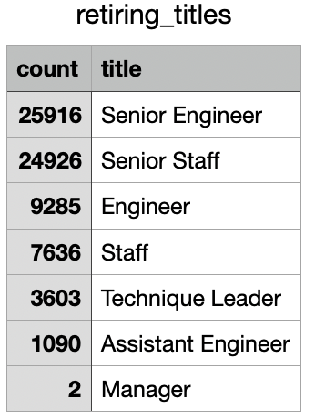

# Pewlett-Hackard_Analysis

## Overview
The purpose of this analysis was to help Pewlett Hackard prepare for an upcoming wave of employees getting ready to retire. Since thousands of positions will need to be filled following this retirement wave, it is important to understand who will be retiring and what/how many positions will need to be filled. The module 7 challenge specifically aims to, "determine the number of retiring employees per title, and identify employees who are eligible to participate in a mentorship program". 

## Results
- The first major takeaway from this analysis is that the vast majority of the positions that will need to be filled are senior level positions. Specifically, senior engineers and senior staff. 
- However, the 3rd and 4th most needed to be filled postions are regular engineers and staff. This means, that in general, Pewlett Hackard will need to hire a lot more engineers and general staff. 
- The third major takeway from this analysis is that Pewlett Hackard will need to fill 72,458 positions as this retirement wave occurs. 
- The final takeway is that only two of these positions in need of being filled are managers. The exact numbers that this information is based on can be seen in the table below.

## Summary
